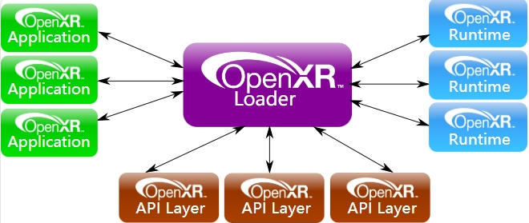
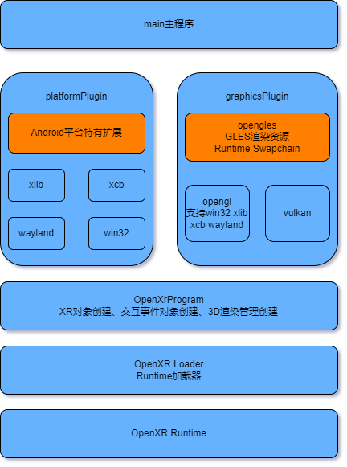

   

## OpenXR涉及到三个源码工程
### OpenXR-SDK-Source
包含hello_xr源码，双目立方体绘制
OpenXR loader, validation layers的实现源码代码库 [https://github.com/KhronosGroup/OpenXR-SDK-Source](https://github.com/KhronosGroup/OpenXR-SDK-Source)

### openxr-android-broker
安卓版本用于发现和管理多个Runtime代码库 [https://gitlab.freedesktop.org/monado/utilities/openxr-android-broker](https://gitlab.freedesktop.org/monado/utilities/openxr-android-broker)

### monado
标准OpenXR Runtime实现代码库 [https://gitlab.freedesktop.org/monado/monado](https://gitlab.freedesktop.org/monado/monado)

## OpenXR文档
openxr specification: [https://registry.khronos.org/OpenXR/](https://registry.khronos.org/OpenXR/)

## OpenXR --- Application Loader Runtime三者的关系

## hello_xr整体架构

main主进程：安卓NativeActivity主入口，用于加载OpenXR Runtime，创建平台相关对象（platformplugin_android），图形渲染库（graphicsplugin_opengles）

platformplugin_android：helloxr demo支持win32 xlib xcb等平台，只关注android平台即可，该模块提供几个重要字段：  
XR_KHR_android_create_instance扩展  
FormFactor: 'Hmd'
ViewConfiguration: 'Stereo'
EnvironmentBlendMode: 'Opaque'
AppSpace: 'Local'

graphicsplugin_opengles：根据运行平台不同，Runtime暴露给App侧的渲染模块可以是D3D，Vulkan，OpenGL，OpenGL ES。Vulkan相对繁琐，以熟悉的OpenGL ES作为研究对象，以此整理App侧（client侧）渲染，渲染结果与Runtime合成关系过程

OpenXR Loader：标准加载器实现，扩展Runtime功能时可能用到，可以自定义自己的特有runtime函数功能库，以替换部分Runtime功能

OpenXR Runtime：[Monado开源引擎](https://gitlab.freedesktop.org/monado/monado)

graphicsplugin_opengles模块  
这个模块主要是完成3D应用场景的绘制,采用opengles绘制的关键点在文件graphicsplugin_opengles.cpp，可以清晰地看到几个关键模块：

（1）利用三方库进行渲染环境创建ksGpuWindow_Create()

EGLDisplay display = eglGetDisplay(EGL_DEFAULT_DISPLAY)  
eglInitialize(display, major, minor)  
EGLConfig eglGetConfigs()  
EGLContext eglCreateContext(d, c, NO_CONTEXT)  
EGLSurface eglCreatePbufferSurface(d, c)  
eglMakeCurrent(display, surface, context)  
可以看到创建的是PBuffer离屏渲染，合成展示在Runtime里完成

（2）GLES资源创建InitializeResources()

glGenFramebuffers # 创建FBO  
glCreateProgram   # 创建立方体绘制需要的shader  
glGenBuffers      # 创建立方体VBO和IBO  

（3）3D场景绘制RenderView(layerView, swapchainImage)

glBindFramebuffer()  
glViewport()  
glFrontFace(GL_CW)  
uint32_t colorTexture = reinterpret_cast<const XrSwapchainImageOpenGLESKHR*>(swapchainImage)->image 
glFramebufferTexture2D(colorTexture| DEPTH)  
glClearColor()  
glClear()  
glUseProgram(m_program)  
矩阵计算：fov pose(position orientation) scale，来自runtime模块
glBindVertexArray(m_vao)// Render each cube  
glDrawElements()  

App侧的Framebuffer的COLOR_ATTACHMENT0和DEPTH_ATTACHMENT来自Runtime的对象：SwapchainImage，也就是说客户端的画布是runtime创建，并通过纹理共享给client的

App侧(client侧)渲染结果如何被Runtime合成的  
这块实现比较复杂，涉及到Runtime的合成器系统（compositor），有几个核心步骤：

（1）Runtime的主合成器（comp_compositor）创建Vulkan渲染环境

（2）Runtime负责衔接Client端合成器（comp_multi_compositor）创建一个共享VK内存

（3）多客户端合成器系统（multi_system_compositor）根据客户端的渲染环境，如GLES GL VK等，用步骤（2）创建的共享VK内存，创建新的纹理对象，如EGLImage，再创建glTexture，然后通过SwapchainImage接口返回给App层使用，用于client端的绘制画布