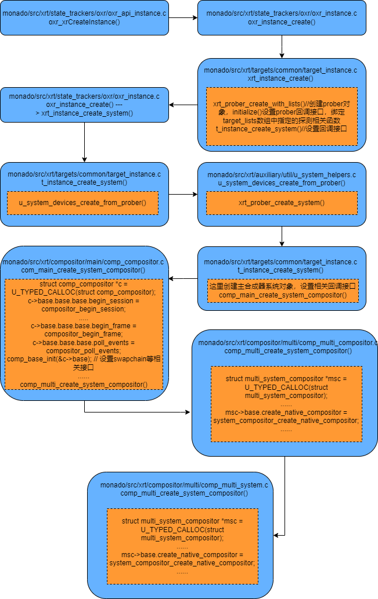
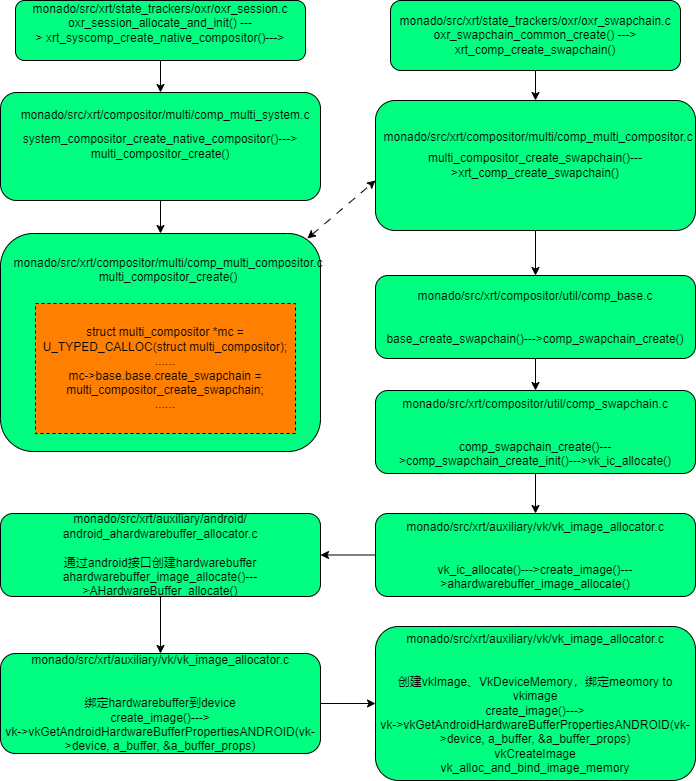

   

## monado在android上创建绘制buffer---vkDeviceImage的流程

openXR的开源实现runtime monado采用vulkan作为后台绘制，下图是从xrCreateInstance开始，分析它是如何创建vkImage、vkDeviceImage的

在xrcreateInstance的过程中，注册了一些列相关回调函数接口，包括如何创建绘制buffer:compositor swapchian--->vkDeviceImage,具体分析看下图：

## 绘制buffer---vkImage是在session是发起的，具体流程如下图

 

创建进程唯一的XR资源句柄（指针）XrInstance，通过XrInstance在runtime层可以找到所有其它对象。Instance创建过程涉及两大核心模块创建：

合成器系统模块（xrt_system_compositor）：持有主合成器，当App开启Session时（client），负责管理client的链接和Layer提交，最终由主合成器合并一层（或多层）到最终画面

设备系统模块（xrt_system_devices）：持有所有设备对象，由Prober模块负责发现，加载

## 主要组件功能

合成器系统multi_system_compositor持有主合成器comp_compositor，用于runtime渲染，采用vulkan，并监听client链接，提交client layer数据到主合成器“逐层”合并渲染，并最终呈现

comp_main  
* vk环境创建，如android window, android view, surface 画布swapchain等资源初始化和创建

* ATW 补帧 distortion等算法实现

* 单层快速绘制，省vk资源

* 多层绘制：先逐层合并渲染，再最终输出

comp_client  
主要用于连接不同客户单渲染环境的，如gl、gles、vulkan、 d3d

* 与mulit_compositor配合，基于共享内存，创建图形库对应的纹理对象，作为画布给App侧进行3D内容绘制

* client layer提交，待合成处理

comp_multi  
* 合成器系统，开启主渲染线程

* 开启客户单监听线程，处理client layer提交

* 提交layer，主合成器完成合成渲染

comp_render comp_util  
vulkan渲染资源和繁琐对象设置

## 主要类
multi_system_devices: 合成器系统的具体实现者，runtime重要模块之一，持有主合成器对象和所有client连接实例,管理主合成器渲染线程

comp_compositor: 主合成器，使用vulkan渲染，负责基础内容绘制和client提交的layer合成绘制，distortion等算法在此完成

multi_compositor：与vk通信，通过HardwareBuffer共享纹理给client端使用，并负责client layer提交给主合成器合并渲染

xrt_compositor：所有compositor（native和非native类型）基类，与XrSession相同生命周期

附录  
[基于 HardwareBuffer 实现 Android 多进程渲染](https://robot9.me/hardwarebuffer-multi-process-rendering/)

