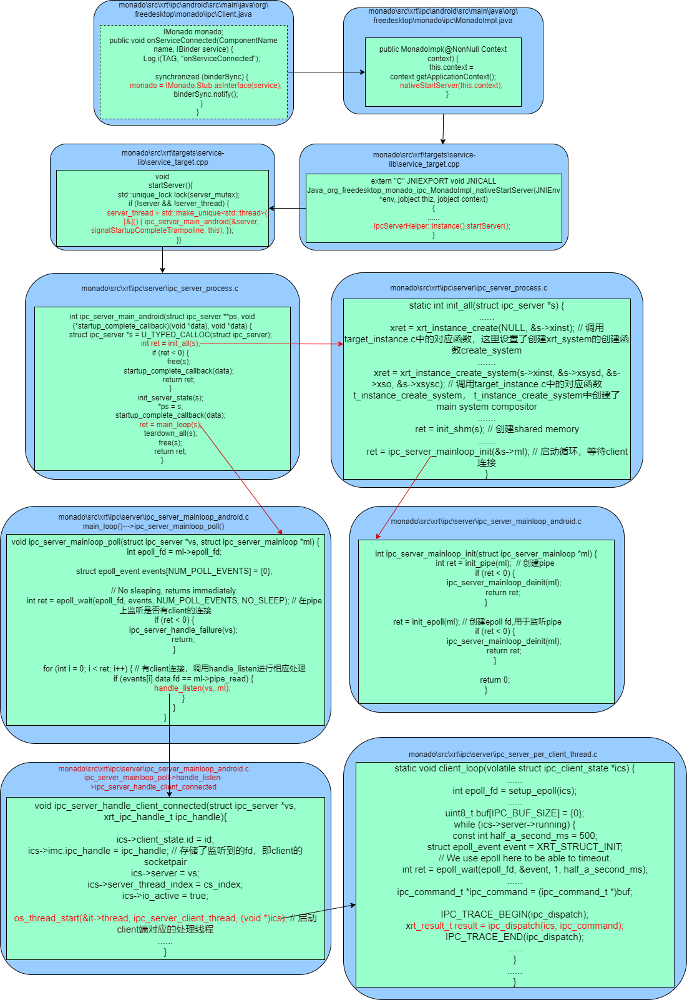
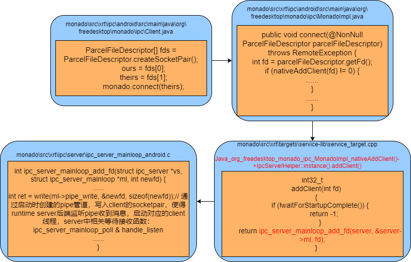
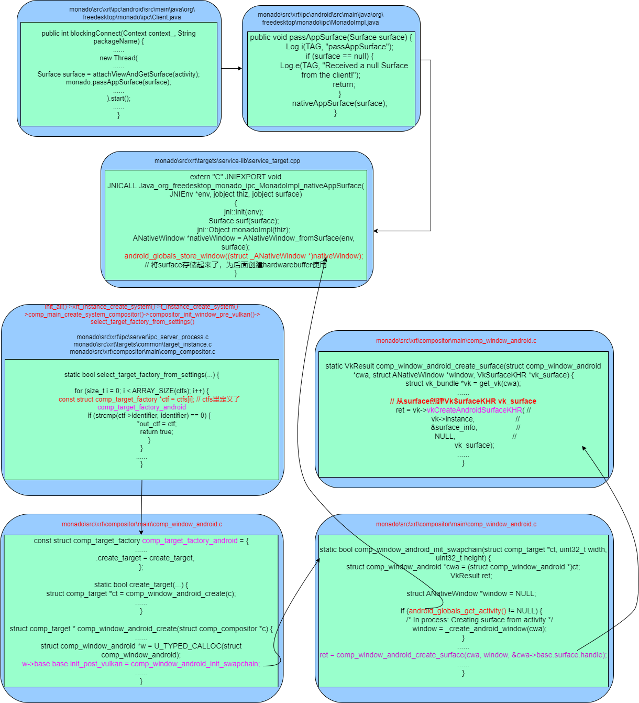
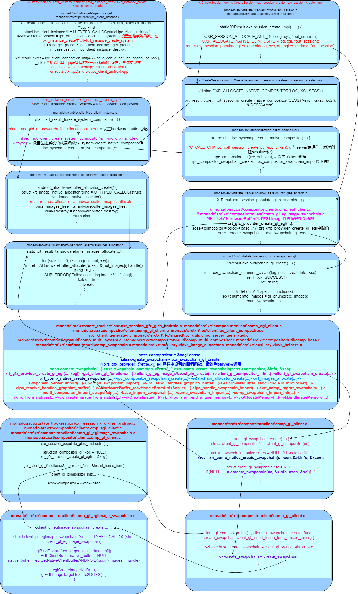

   

monado out of process模式在android上的启动连接流程，采用的是AIDL方式进行创建后台runtime server的，采用SocketPair进行pipe通信。

涉及面较广，包含java和ndk两个层面的内容。

java文件路径：monado\src\xrt\ipc\android\src\main\java\org\freedesktop\monado\ipc

## 从apk启动runtime server的主要流程

 
ipc_server_main_android分析   

1. 创建struct ipc_server s，并将其返回给应用层使用；  
2. init_all(s)中创建了server端多个重要组件和回调函数设置：
    xrt_instance xinst: xrt_instance_create(),这是调用target_instance.c中的函数创建的；  
    xrt_system: xrt_instance_create_system--->t_instance_create_system，创建了系统合成器system compositor，并且设置了compositor base的相关函数---vk swapchian的创建等;  
    shared memory:init_shm(s)传递数据的共享内存块；  
    ipc_server_mainloop_init()：pipe的创建以及初始化设置；  
3. main_loop()：循环调用ipc_server_mainloop_poll，在pipe上轮询看是否有client连接上来，以作进一步的处理，最终的进到ipc_dispatch()中进行消息的处理；  

## client端从java层到连接runtime server的流程

 
有了上面的runtime server启动分析过程，client端连接到server端非常清晰

## server端如何创建VkSurfaceKHR的过程

 
server端创建VkSurfaceKHR是通过将java层创建的surface通过pipe管道，传递给server端，在server端最终调用vkCreateAndroidSurfaceKHR来创建的，具体的过程如图所示。

## swap_chain的创建到EGLImage的过程

 
swap_chain的创建是在session中设置回调接口发起的，它在client端创建了image buffer，然后借助shared memory通过pipe管道通信传递到server端持有，然后又通过  
eglGetNativeClientBufferANDROID(xscn->images[i].handle)拿到buffer创建EGLImage的,流程比较复杂。  
<b>在client端通过swapchain_allocator_create创建image buffer，然后将句柄handle传递到server端，</b>过程非常复杂，涉及到非常多的文件:   
monado\src\xrt\ipc\android\src\main\java\org\
freedesktop\monado\ipc\Client.java 
monado\src\xrt\ipc\android\src\main\java\org\
freedesktop\monado\ipc\MonadoImpl.java
monado\src\xrt\targets\service-lib\service_target.cpp  
monado\src\xrt\ipc\server\ipc_server_process.c  
monado\src\xrt\targets\common\target_instance.c  
monado\src\xrt\state_trackers\oxr\oxr_session.c
monado\src\xrt\ipc\client\ipc_client_compositor.c   
ipc_client_generated.c  
monado\src\xrt\ipc\shared\ipc_utils.c  
ipc_server_generated.c  
monado\src\xrt\compositor\multi\comp_multi_system.c  
monado\src\xrt\compositor\multi\comp_multi_compositor.c  
monado\src\xrt\compositor\util\comp_base.c  

monado\src\xrt\compositor\util\comp_swapchain.c  
monado\src\xrt\auxiliary\vk\vk_image_allocator.c  
monado\src\xrt\auxiliary\vk\vk_helpers.c
monado\src\xrt\state_trackers\oxr\oxr_session_gfx_gles_android.c  
monado\src\xrt\compositor\client\comp_egl_client.c  
monado\src\xrt\compositor\client\comp_gl_eglimage_swapchain.c  
monado\src\xrt\compositor\client\comp_gl_client.c

