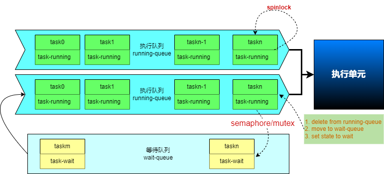

信号量、互斥锁和自旋锁都是并发编程中用于控制多个线程或进程对共享资源访问的同步机制，它们各有特点和适用场景。

## 定义

### 信号量（Semaphore）：
1) 是一种取值为整数的变量，表示可用的临界资源数目或等待资源的进程数。 
2) 进程调用PV原语（即等待（P）和信号（V）操作）来改变该变量的值，用以实现进程间的同步或互斥。 
3) 类似于一个计数器，控制对共享资源的访问数量。 
4) 允许一定数量的进程或线程同时访问资源，超过这个数量的线程需要等待，直到有更多资源可用。 

### 互斥锁（Mutex）：
1) 实现了“互相排斥”（mutual exclusion）同步的简单形式，因此得名， 是一种计数取值为1的特殊信号量。 
2) 禁止多个进程或线程同时进入受保护的代码“临界区”。 
3) 在任意时刻，只有一个进程或线程被允许进入这样的代码保护区。 
4) 当一个线程获得了互斥锁，其他试图获取该锁的线程将被阻塞，直到持有锁的线程释放它。 

### 自旋锁（Spin Lock）：
1) 专为防止多处理器并发而引入的一种锁。 
2) 如果锁已被其他执行单元保持，调用者会持续循环检查锁是否已释放，而不是进入睡眠状态。 
3) 适用于锁持有时间非常短的场景。 

## 工作机制

### 信号量：
1) 允许多个线程同时访问共享资源，但总数不超过信号量的值。 
2) 线程通过等待（P操作）减少信号量值来获取资源，释放资源时通过信号（V操作）增加信号量值。 

### 互斥锁：
1) 锁争用时，如果锁被持有，线程可能会选择自旋等待（即忙等待）一段时间，以避免立即进入睡眠状态导致的上下文切换开销。 
2) 如果自旋等待失败，线程将进入睡眠状态，直到锁被释放并被重新获取。 

### 自旋锁：
1) 当一个线程尝试获取一个已经被其他线程持有的自旋锁时，它不会立即阻塞，而是继续循环（自旋）检查锁的状态，直到锁变为可用状态。 
2) 这意味着在锁被释放之前，线程会一直占用CPU资源。 

### 底层实现原理与工作过程及特点

#### 信号量与互斥锁

##### 原理
1) 依赖于操作系统提供的原语或者系统调用，如信号量、互斥量等。 
2) 可能使用硬件提供的原子操作，但不依赖CAS指令。 

##### 过程
1) 当一个线程尝试获取锁时，它会使用原语或系统调用尝试获取锁。 
2) 如果锁是可用的，线程成功获取锁并进入临界区执行任务。
如果锁已被其他线程持有，当前线程会被阻塞，并被放入锁的等待队列中。 
3) 等待队列中的线程在锁释放时被唤醒，并有机会竞争锁。 

##### 特点
1) 使用操作系统提供的原语或者系统调用来实现。 
2) 可能涉及线程的阻塞和唤醒，导致较高的开销。 
3) 适用于长期占用临界资源的情况。 

#### 自旋锁：

##### 底层实现原理
依赖于硬件提供的原子操作，通常使用CAS指令。

##### 工作过程
1) 当一个线程尝试获取锁时，它会循环检查锁的状态。 
2) 如果锁是可用的，线程成功获取锁并进入临界区执行任务。 
3) 如果锁已被其他线程持有，当前线程会在一个循环中等待，直到获取到锁。 

##### 特点
1) 使用硬件提供的原子操作来实现，通常使用CAS指令。 
2) 不会涉及线程的阻塞和唤醒，减少了线程切换的开销。 
3) 适用于短期占用临界资源的情况。 

## 适用场景

### 信号量：
1) 信号量比互斥锁更灵活，因为它可以控制多个相同类型资源的同时访问。 
2) 适用于需要限制同时访问共享资源的线程数量的场景。 
例如，控制同时访问打印机的线程数量。 

### 互斥锁：
1) 通常用于操作系统或应用程序中需要等待较长时间才能完成的操作，因为当线程被阻塞时它可以被调度去执行其他任务。 
2) 适用于需要严格互斥访问共享资源的场景。例如，保护数据结构或文件的完整性，确保在任意时刻只有一个线程可以修改它们。 

### 自旋锁：
1) 自旋锁主要用于非常短的操作，以减少上下文切换的开销，因为如果线程在自旋过程中消耗了太多CPU周期而没有获得锁，则会导致不必要的CPU使用率增加。 
2) 在实时系统或者操作系统内核中，自旋锁经常被用到，因为在这些环境中避免上下文切换是很重要的。 
3) 在多处理器系统中，用于保护短时间的临界区访问。 

## 性能考虑

### 信号量：
由于可能导致线程进入睡眠状态，因此在锁争用不频繁时性能较好。频繁的睡眠和唤醒操作会引入额外的上下文切换开销。

### 互斥锁：
提供了较好的性能和可扩展性，特别是在锁争用激烈的场景下。
通过自旋等待机制减少了上下文切换的开销。

### 自旋锁：
在锁持有时间极短的情况下，性能优于互斥锁和信号量。
但如果锁持有时间较长，会浪费大量CPU资源。

## 总结：

1) 信号量Semaphore提供了一种更通用的方式来管理对有限资源的访问。 
2) 互斥锁Mutex适用于需要长时间持有锁的情况，并且在等待期间可以释放CPU资源。 
3) 自旋锁Spinlock用于快速操作并且避免阻塞，通常在中断处理程序或需要快速响应的情况下使用。 

综上所述，信号量、互斥锁和自旋锁在并发编程中各有优缺点和适用场景。选择哪种同步机制取决于具体的应用需求和性能考虑。